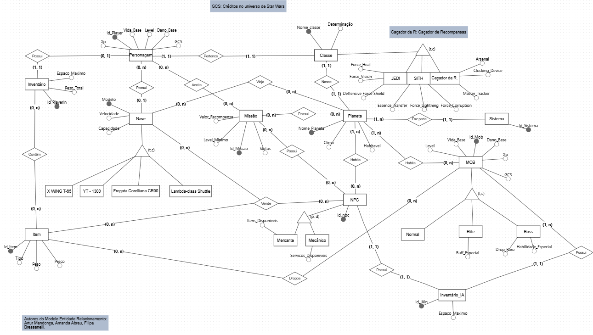

# Modelo Entidade-Relacionamento – Star Wars (SBD1)

## Introdução

Este documento apresenta o Modelo Entidade-Relacionamento (MER) desenvolvido para o banco de dados do jogo Star Wars, no contexto da disciplina de Sistemas de Banco de Dados 1 (SBD1). O MER foi elaborado visando representar de forma clara e estruturada as entidades, atributos e relacionamentos essenciais para o funcionamento do jogo, garantindo integridade, flexibilidade e aderência às regras de negócio do universo Star Wars.

O modelo foi construído de forma colaborativa, considerando as melhores práticas de modelagem e as necessidades específicas do projeto, como a gestão de personagens, naves, missões, itens, planetas, sistemas estelares, NPCs e MOBs.

## Acesso ao Modelo Online

O modelo entidade-relacionamento pode ser visualizado online através do BRModeloWeb:
- [Visualizar MER no BRModeloWeb]([https://app.brmodeloweb.com/#!/publicview/68140cddafaa9fcadd1c98f6](https://app.brmodeloweb.com/#!/publicview/686c7f2e7664710e8462ed2c))

**Observação:**
- O link é público e permite apenas visualização, não edição.

## Descrição Geral do Modelo

O MER contempla as seguintes entidades principais:
- **Personagem**: Representa o jogador, com atributos como vida, dano, experiência, classe e planeta de origem.
- **Classe**: Define o tipo de personagem (Jedi, Sith, Caçador de Recompensas), com habilidades específicas.
- **Nave**: Modelos de naves disponíveis, associadas aos personagens.
- **Missão**: Tarefas que podem ser aceitas pelos personagens, com recompensas e requisitos.
- **Planeta**: Mundos habitáveis, cada um pertencente a um sistema estelar.
- **Sistema**: Sistemas estelares que agrupam planetas.
- **Inventário**: Gerencia os itens possuídos pelos personagens.
- **Item**: Objetos que podem ser coletados, utilizados ou comercializados.
- **NPC**: Personagens não jogáveis, podendo ser mercantes ou mecânicos.
- **MOB**: Inimigos do jogo, classificados em normal, elite ou boss.

## Diagrama Entidade-Relacionamento

  

<b>Autores:</b> Artur Mendonça, Amanda Abreu, Filipe Bressanelli, 2025.

## Referências Bibliográficas

- Elmasri, R.; Navathe, S. B. **Sistemas de Banco de Dados**. 7ª ed. Pearson, 2017.
- Heuser, C. A. **Projeto de Banco de Dados**. 7ª ed. Bookman, 2022.
- Date, C. J. **Introdução a Sistemas de Bancos de Dados**. 8ª ed. Pearson, 2004.
- Chen, P. P. **The Entity-Relationship Model—Toward a Unified View of Data**. ACM Transactions on Database Systems, v. 1, n. 1, 1976.
- Sommerville, I. **Engenharia de Software**. 9ª ed. Pearson, 2019.
- [The Star Wars Database](https://www.starwars.com/databank)
- Documentação oficial da disciplina SBD1 – UFMS, 2025.

## Histórico de Versões

| Versão | Data       | Modificações                                      | Autor(es)     | Revisor(es) |
|--------|------------|---------------------------------------------------|---------------|-------------|
| 1.0    | 02/05/2025 | Criação do documento de modelo entidade-relacionamento  | [Artur Mendonça](https://github.com/ArtyMend07), [Amanda Abreu](https://github.com/Amandaaaaabreu), [Filipe Bressanelli](https://github.com/fbressa) |  [Eduardo Morais](https://github.com/Edumorais08) |
