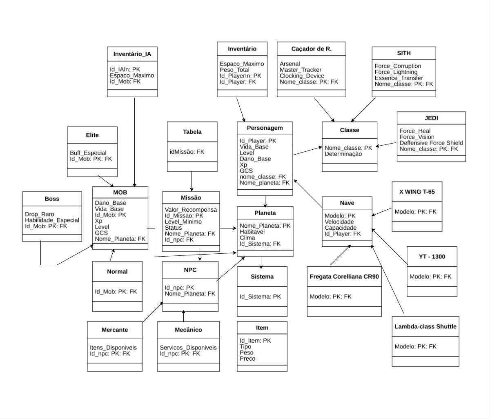

# Modelo Relacional

 
O Modelo Relacional(MREL) apresenta um diagrama lógico de como as entidades e seus relacionamentos serão mapeados no banco de dados. Esse artefato é um modelo não atrelado a nenhum sistema de gerenciamento de banco de dados (SGBD) específico.

 

<h1 align="center">

</h1>

  
Figura 1: MREL Star Wars

  
Autor: Eduardo Morais

## Histórico de Versões

| Versão | Data       | Modificações                                      | Autor(es)     | Revisor(es) |
|--------|------------|---------------------------------------------------|---------------|-------------|
| 1.0    | 02/05/2025 | Criação do documento de modelo relacional | [Eduardo Morais](https://github.com/Edumorais08) | [Artur Mendonça](https://github.com/ArtyMend07) |